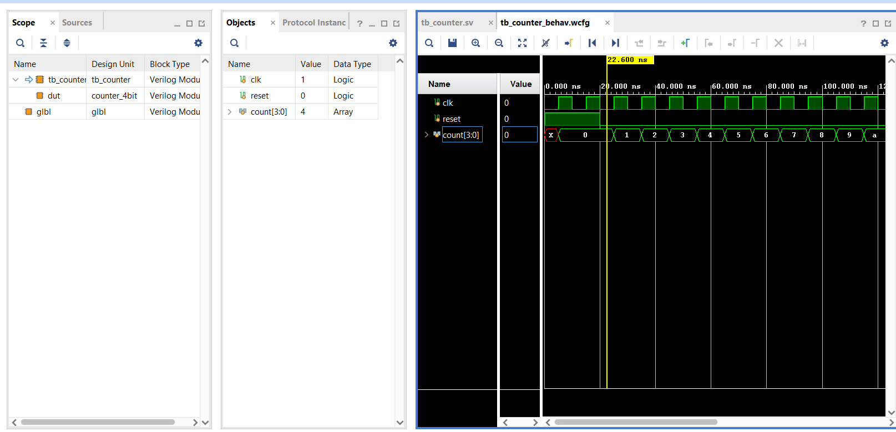
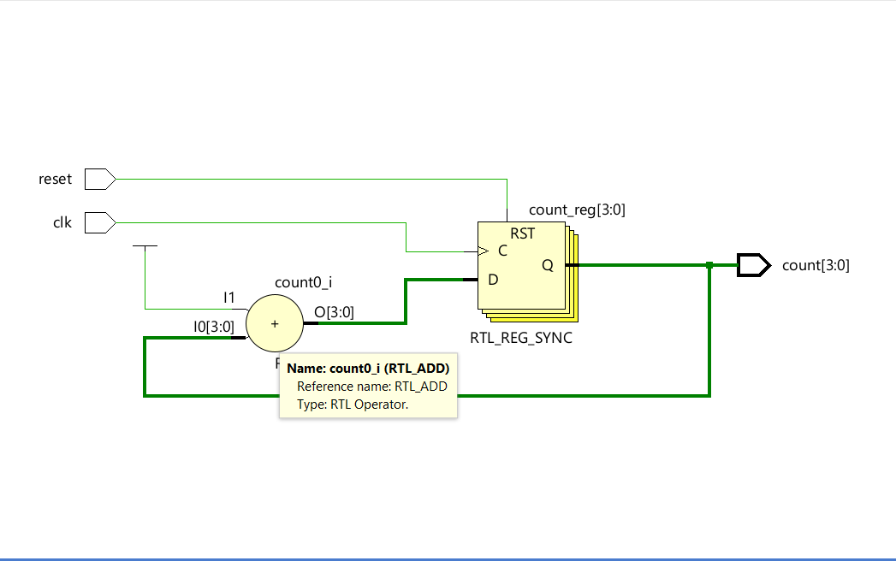

# Vivado Binary Counter (4-Bit)

## 📌 Project Overview
This project implements a **4-bit synchronous binary counter** using **Xilinx Vivado**. It is designed to demonstrate digital logic principles, specifically sequential circuits, clock division, and hardware resource utilization on an FPGA.

The design was synthesized and simulated for the **Digilent Nexys A7** development board (Artix-7 FPGA).

## 📊 Simulation & Results
### Behavioral Simulation
The waveform below verifies the counter's operation, showing the incrementing binary value on every clock cycle.


### RTL Design (Synthesized Logic)
The schematic below illustrates the hardware logic generated by Vivado, highlighting the 4-bit register bank (`count_reg`) and the adder logic.


## ⚙️ Core Logic (Verilog)
The counter is implemented using standard sequential logic. Below is the core snippet of the design:

```verilog
always @(posedge clk or posedge reset) begin
    if (reset)
        count <= 4'b0000;      // Reset counter to 0
    else
        count <= count + 1;    // Increment on rising edge
end